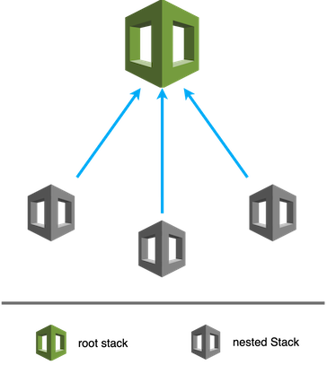

# aws-cloudformation-ecs-php-template
This repository consists of a set of nested templates that deploy the following:

- ECS cluster and services. Runing PHP Laravel application with Nginx.
- Codepipeline that will automate the steps required to release the application changes continuously. Which is in another GitHub repository..
- Another Codepipeline that will automate the steps required to release the CloudFormation templates changes continuously.

## Prerequisites
* Cloud​Formation, [How it works](https://aws.amazon.com/cloudformation/)
* AWS account predefined with the following resources:
    - VPC
    - Subnets
    - Security Groups
    - [EC2 key pair](https://docs.aws.amazon.com/AWSEC2/latest/UserGuide/ec2-key-pairs.html#having-ec2-create-your-key-pair). This is necessary to for EC2 Launch Type.
* A GitHub repository for the application code with the [required artifacts](./docs/app-repo-artifacts.md).
* [Fork this repo](https://help.github.com/en/articles/fork-a-repo) so that you have a copy of the templates.


## Template details

The templates below are included in this repository and reference architecture:

| Template | Description |
| --- | --- | 
| [cf-master.yaml](cf-master.yaml) | This is the master template - which includes all of the other child templates. |
| [cf-ecs.yaml](cf-ecs.yaml) | This template deploys a web application in an Amazon ECS container with autoscaling and an application load balancer. For more information, see [Getting Started with Amazon ECS](https://docs.aws.amazon.com/AmazonECS/latest/developerguide//ECS_GetStarted.html) in the Amazon Elastic Container Service Developer Guide. |
| [cf-app-pipeline.yaml](cf-app-pipeline.yaml) | This template creates a pipeline that will detect code changes through push event in GitHub branches and pull them into the pipeline. New docker images will be built in CodeBuild and trigger ECS zero-downtime redeployment. |
| [cf-cloudformation-pipeline.yaml](cf-cloudformation-pipeline.yaml) | This     template will creates a pipeline that performs the following workflow to update Cloudformation stacks: <ol><li>The first stage of the pipeline retrieves a source artifact (an AWS CloudFormation template and its configuration files) from this GitHub repository.</li><li>In the second stage, it use [Cloudformation Package](https://docs.aws.amazon.com/cli/latest/reference/cloudformation/package.html) command to compile and upload the artifacts to S3. It returns a copy of your template, replacing references to local artifacts with the S3 location where the command uploaded the artifacts.</li><li>In the third stage, the pipeline creates a change set against an existing stacks, sends an email notification and then waits for your approval. <br><br>In your initial run, you won't have a stack exist. The change set shows you all of the resources that AWS CloudFormation will create. If you approve, this stage executes the change set and builds your stack.</li></ol> | 
| [config/*](config/) | This folder contains JSON-formatted text [Template Configuration File](https://docs.aws.amazon.com/AWSCloudFormation/latest/UserGuide/continuous-delivery-codepipeline-cfn-artifacts.html#w2ab1c13c15c15) that can specify template parameter values, a stack policy, and tags. Which is only used in CodePipeline that performs Cloudformation changes. [Learn more](https://docs.aws.amazon.com/AWSCloudFormation/latest/UserGuide/continuous-delivery-codepipeline-cfn-artifacts.html). |
| [cf-master-ecs-ec2.yaml](cf-master-ecs-ec2.yaml) and [cf-ecs-ec2.yaml](cf-ecs-ec2.yaml) | Templates for launch the ECS services in EC2 launch type. |

<p align="center">
    
</p>


## Getting started

#### Upload artifacts
Package and upload the local artifacts with [Cloudformation package](https://docs.aws.amazon.com/cli/latest/reference/cloudformation/package.html) command.

```
aws cloudformation package --template-file $CF_MASTER_TEMPLATE_FILE_NAME \
        --s3-bucket $CODEPIPELINE_S3_BUCKET_NAME \
        --s3-prefix cf-stacks-template \
        --output-template-file transformed-$CF_MASTER_TEMPLATE_FILE_NAME
```

#### Creating stacks

Use the AWS [CloudFormation Console](https://console.aws.amazon.com/cloudformation/home) to run the master template. Click the "Create Stack" button in the upper left corner of the console, then under "Choose a template", select "Upload a template to Amazon S3" and click "Browse" to find your local template file.


## Documentation

- [Securing GitHub Tokens with Secrets Manager](./docs/secure-github-token.md)
- [Enable HTTPS support](./docs/alb-https-support.md)
- [Uploading nested template to an S3 Bucket](./docs/upload-cf-artifacts-s3.md)
- [Cost-Efficient ECS services with Scheduled Lambda](./docs/ecs-scheduled-lambda.md)
- [Required artifacts in application repository](./docs/app-repo-artifacts.md)


## Reference

- [The StartupKit-templates repo](https://github.com/aws-samples/startup-kit-templates)
- [Cloudformation User Guide](https://docs.aws.amazon.com/AWSCloudFormation/latest/UserGuide/Welcome.html)
- [Cloudformation Template Snippets](https://docs.aws.amazon.com/AWSCloudFormation/latest/UserGuide/CHAP_TemplateQuickRef.html)
- [Cloudformation Continuous Delivery](https://docs.aws.amazon.com/AWSCloudFormation/latest/UserGuide/continuous-delivery-codepipeline-basic-walkthrough.html)


## Contributing

Any improvements or suggestions are welcomed. Just do a commit or pull request.


[TO-DO](./to-do.md)