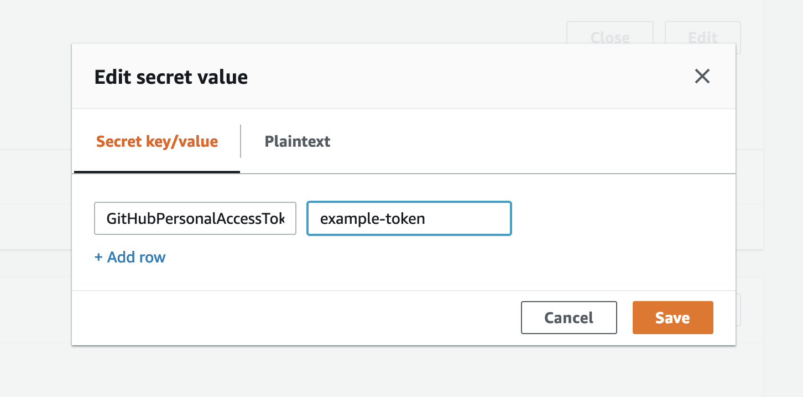

## Securing GitHub Tokens with Secrets Manager

CodePipeline uses GitHub OAuth tokens and personal access tokens to access your GitHub repositories. We don't want any credential or such token to be stored in the source control when using an Infrastruture-as-Code approach.

We can solve the problem with Secrets Manager. [Reference](https://medium.com/@eoins/securing-github-tokens-in-a-serverless-codepipeline-dc3a24ddc356).

Inlcude Secret Manager in Cloduformation template in the first run and pass in a valid GitHub Personal Access Token in `Parameters` section.
```
GitHubTokenSecret:
    Type: AWS::SecretsManager::Secret
    Properties:
      Name: !Sub ${AWS::StackName}-GitHubTokenSecret
      Description: This secret has a GitHub token in SecretString
      SecretString: !Sub '{"GitHubPersonalAccessToken":"${GitHubToken}"}'
```

You can manually update the token in AWS Console, by whoever that have the right access.
<p align="center">
    
</p>

However, the value will change back to `github-token-example` with the CodePipeline, which is set in Template Configuration File, upon the Cloudformation changes. To avoid this, we prevent updates of the Secret Manager by adding a [Stack Policy](https://docs.aws.amazon.com/AWSCloudFormation/latest/UserGuide/protect-stack-resources.html) in Template Configuration File.
```
{
  "Statement" : [
    {
      "Effect" : "Allow",
      "Action" : "Update:*",
      "Principal": "*",
      "Resource" : "*"
    },
    {
      "Effect" : "Deny",
      "Action" : "Update:*",
      "Principal": "*",
      "Resource" : "LogicalResourceId/YOUR_RESOURCES_LOGICAL_ID"
    }
  ]
}
```

